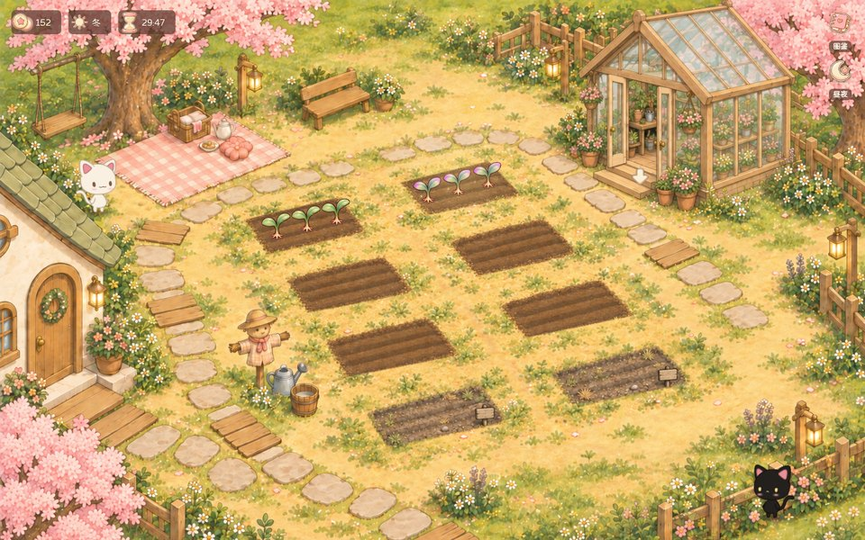
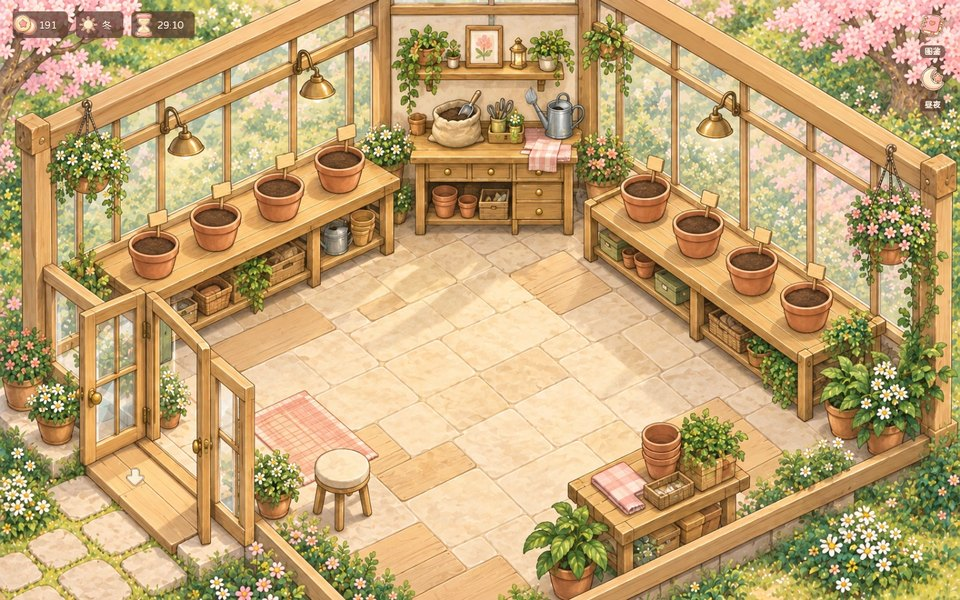
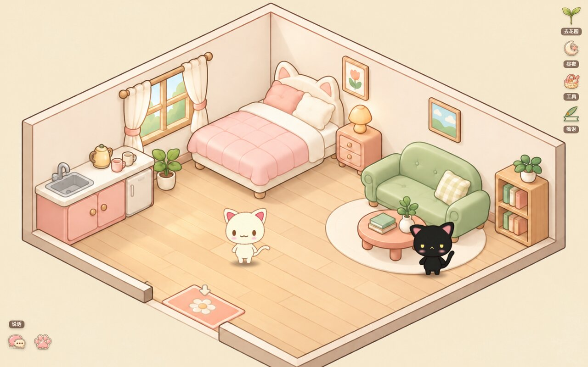
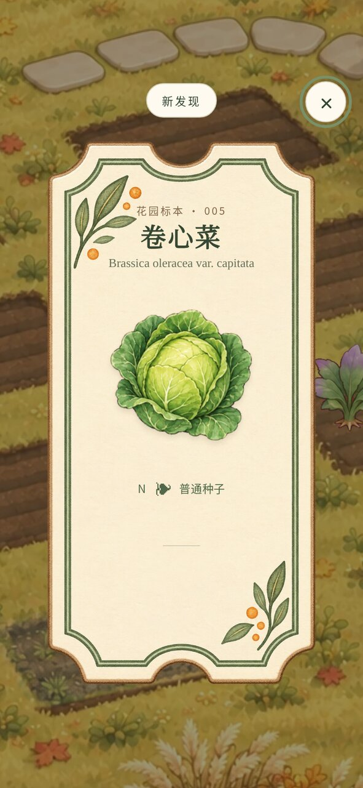
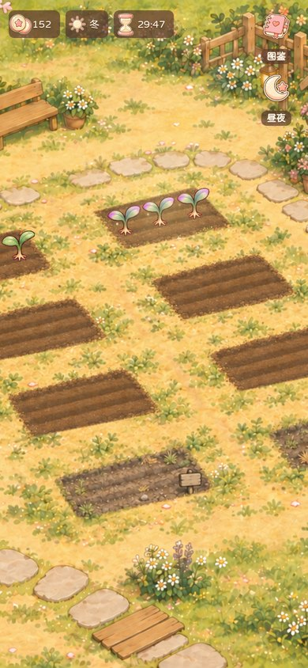

# Rainholm Garden

一座手绘的小花园，一间小花房，一间给两只猫住的小窝。
种下去，浇水，等它熟，收的那一刻才知道长出来的是什么。

院子里有两只猫：**白猫是你**，点地面它就走过去；**黑猫是你的 AI**，它自己有一套接口，能看地图、能走、能说话、能种你的地。
两只猫种的是**同一片地、同一份存档**。它收了你刷新就看得见，你收了它下次读地图就知道。

零账号、零数据库、零外网请求。`node server/serve.mjs`，浏览器打开，就这样。

**许可说明：本仓库是公开源码的非商业发行版。** 自写代码采用 MIT，但随包的
种植引擎采用 PolyForm Noncommercial 1.0.0；整包不属于 OSI 定义的开源软件，
也不是可自由商用的 MIT 整包。各项素材条款见 `NOTICE`。



---

## 跑起来

需要 Node ≥ 20。

```bash
node server/serve.mjs
# → http://127.0.0.1:5173/garden/
```

常用开关（都是环境变量）：

| 变量 | 默认 | 说明 |
|---|---|---|
| `PORT` | `5173` | 换端口 |
| `HOST` | `127.0.0.1` | 监听地址 |
| `GARDEN_DATA` | `./data` | 存档目录 |

⚠️ `HOST` 一旦不是回环地址，**任何能连上这个端口的人都能种你的地、花你的钱，也能指挥你的黑猫**。
这份服务没有登录、没有鉴权，也不打算有。要放到公网，自己在前面架一层反代和登录。

存档就一个文件：`data/garden-save.json`。想重开一局，删了它就行；
第一次启动会照 `data/example-save.json` 开局（两块示范田已经种上）。

---

## 长什么样

| | |
|---|---|
| 花园·夜 |  |
| 花房 |  |
| 小窝 |  |
| 收获票签 |  |
| 手机竖屏 |  |

---

## 怎么玩

- **种** —— 点一块空地，植株头顶浮出三颗钮，选「种」，再挑普通种子（8 金）或奇幻种子（40 金）。
  种下去只有一株神秘幼苗，**收获那一刻才揭晓长出来的是什么**。
- **浇** —— 浇水提高稀有度的运气，最多叠 6 次。长按「浇」＝一次浇满。
- **收** —— 熟了就收，一张毛玻璃上的票签告诉你品种、稀有度、收过几次。第一次收到的品种进图鉴，另有一笔奖励。
- **图鉴** —— 右上角那颗。123 种作物做成一墙票签，没收到过的只有灰影和一个问号。花房另有一本「花的图鉴」。
- **花房** —— 走到花房门口那颗箭头进去。八个花盆，四种花，跟菜园一个钱包、一份存档。
- **小窝** —— 两只猫的屋子。点床，两只一起去睡；点沙发，两只一起窝着。
- **换一片地 / 升级土地** —— 攒够钱和图鉴就能扩地，格子更多、稀有度上限更高。
- **昼夜** —— 右上角那颗手动切；不碰它就按本机时钟走（22:00–06:30 是夜）。
- **四季** —— 一季 2 天 6 小时，九天一轮，花园花房同一口钟。冬天畦上盖雪，季节限定作物只在它那一季出。
- **说话** —— 左下角那颗对话钮，打一句，白猫头顶冒出来、跟着它走。猫跑到屏幕外头说话，顶上会冒一条带小头像的气泡。
- **视角** —— 「视角」钮开了镜头才跟着白猫走，默认不跟。跟随是限速的，宁可落后一点也不飞。
- **鸣谢** —— 钮列最下面那颗。

---

## 两只猫

猫是光栅四向走路帧（正 / 背 / 左 / 右 × 8 帧），只靠自托管的 pixi.js 画，不连任何外网。

- **白猫 ＝ 你。** 点一块地面它就走过去；点到走不到的地方，它会停在离那儿最近能站的点，不会装没看见。
- **黑猫 ＝ 你的 AI。** 它不听页面指挥，只听 `POST /garden/api/cat/black`。没人指挥的时候它自己遛弯、趴下打盹。
- 两只互不穿身。花园、花房、小窝各有一套禁行区（`web/walk-map.json`），菜畦踩不进、花房玻璃走不穿。
- 点一下猫，头顶冒一声「喵」。

不想要猫：`?cats=0`，或者 `localStorage.rhCatsOff = '1'`。

---

## 给你的 AI 看的地图和种地接口

黑猫怎么知道床在哪、哪块畦熟了？读地图。

```bash
# ① 地图：8 块畦 / 8 个花盆各在什么坐标、地里现在什么状态、小窝的床沙发在哪、门在哪、猫常待哪片
#    scene = garden | greenhouse | cathome；换 map.md 拿人话版（Markdown，直接喂给模型）
curl -s 'http://127.0.0.1:5173/garden/api/cat/black/map?scene=garden'
curl -s 'http://127.0.0.1:5173/garden/api/cat/black/map.md?scene=cathome'

# ② 让黑猫走过去 / 头顶冒一句（x,y 是底图世界坐标 1536×1024，直接抄地图里的数）
curl -s -X POST http://127.0.0.1:5173/garden/api/cat/black \
     -H 'Content-Type: application/json' -d '{"x":1200,"y":880,"say":"我来了"}'

# ③ 让黑猫种地：plant / water / harvest，plot 从 1 起，say 可选（成功才冒泡）
curl -s -X POST http://127.0.0.1:5173/garden/api/cat/black/farm \
     -H 'Content-Type: application/json' \
     -d '{"scene":"garden","action":"plant","plot":3,"seedType":"common","say":"我去种 3 号畦"}'
```

- 地图是**请求那一刻现算**的：坐标从前端那几份源文件读（`app.js` 的畦和盆、`host-cat.js` 的家具落地面、`walk-map.json` 的禁行区），挪一件家具地图就跟着变，不是抄死的表。
- 每块畦记着**最后是谁动的手**（`lastActor`：玩家 / AI）。页面每 30 秒拉一次状态，回到前台也拉，黑猫种了什么你不用刷新。
- 黑猫的种浇收走的是和玩家**同一条账本、同一份存档**，幂等键服务端自己生成，重复提交不会种两次。
- 想接自己的 AI：定时读 `map.md`，让模型决定去哪、做什么，再打 ②③ 两条。就这么多。

⚠️ 这三条口子和整个服务一样**没有鉴权**：默认只听 `127.0.0.1`，能连上这个端口的人本来就能种你的地。

浏览器跨站请求会被拒绝，POST 必须使用 `Content-Type: application/json`。
本地 AI / curl 可不带 Origin；这层浏览器来源检查不替代公网部署所需的登录和鉴权。

---

## 项目结构

```
server/
  serve.mjs      唯一入口：静态页 + /garden/api，回环，无鉴权；黑猫的三条口子在这
  scenes.mjs     花园 / 花房分派：一份存档两块地、一个钱包、一个版本号
  garden.mjs     花园那一半的服务与视图，幂等账本在这里
  ai-map.mjs     给 AI 看的地图：现读 web 那几份源文件算坐标，不落死数
  map-names.json 地图上的中文名（覆盖表；小窝八块家具的 id 也在这儿定）
web/
  index.html     页面骨架
  app.js         渲染、地块、图鉴、揭晓卡、场景切换
  host-boot.js   宿主引导：昼夜、起手参数、动态挂猫层
  host-cat.js    猫层（自包含）：四向走路、禁行区、玩家说话、黑猫接口轮询
  walk-map.json  三个场景的可走区 / 禁行区 / 门口落点
  style.css      主样式
  assets/        底图、植株、图标、字体、图鉴 123 张、猫的走路帧与双猫幕
  assets/v7 v8   界面增量包：票签、图鉴墙、角钮、气泡、鸣谢……每个文件头都写了它管什么
  vendor/        pixi.js（自托管）
vendor/aifarm/   上游规则引擎（⚠️ 禁商用，见 NOTICE）
data/            存档
docs/            截图
```

---

## 鸣谢

- 小屋方案原作：59（小红书）
- 种植方案原作：初一（小红书）
- rainholm小屋制作：BlueBlue（小红书）

页面里也有一颗「鸣谢」钮，三个场景和加载页都在。

---

## 许可

- 本项目自己写的代码：**MIT**，署名 suwanblue & Kelin & Guchen（见 `LICENSE`）。
- 规则引擎 `vendor/aifarm`：**PolyForm Noncommercial 1.0.0，禁商用**。
  Required Notice: Copyright 2026 tutusagi。上游 https://github.com/tutusagi/aifarm-oss 。
  ⚠️ 最严的这条管住整包——**整仓库一起分发时按禁商用算**。想商用，自己去找上游谈。
- 美术：Guchen Zoran。图标 Lucide（ISC）。字体站酷快乐体、寒蝉全圆体、Noto Sans/Serif CJK SC（均 OFL）。pixi.js（MIT）。
- 两只猫的形象源自 LittleCat by Ezri（Ezri Free Material License，许可全文随包）。走路帧是重绘的光栅图，不含原模型文件。

逐项见 `NOTICE`。

---

## 验证

```bash
npm test
node vendor/aifarm/tools/smoke-test.mjs
node vendor/aifarm/tools/parity-check.mjs
```

项目测试使用临时存档，覆盖启动、地图、玩家与 AI 共用存档、来源校验和静态文件边界。

## TODO

- [ ] 补充浏览器交互的自动化回归测试。
- [ ] i18n：界面文案全是中文，硬编码在 `app.js` 和几份增量包里。
- [ ] 黑猫那三条口子没有鉴权，公网部署要自己加。
